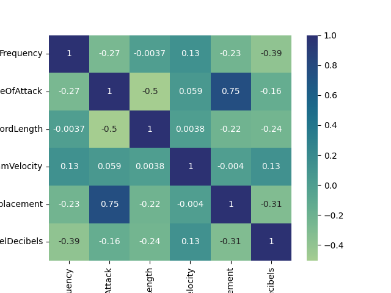

# PySpark ML Pipeline for Airfoil Noise Prediction

This project builds a PySpark ML pipeline to predict airfoil noise levels using the [NASA Airfoil Self Noise](https://archive.ics.uci.edu/dataset/291/airfoil+self+noise) dataset. It covers data preparation, exploratory analysis, regression model benchmarking, and cross-validation-based optimisation.

The workflow compares Linear Regression, Factorization Machines, Random Forest, and Gradient Boosted Trees, with Gradient Boosted Trees achieving the strongest performance on the test set.

The repository includes:
- a notebook for step-by-step exploratory analysis and workflow validation
- modular Python scripts for reproducible training and optimisation runs

## Repository Structure

- `notebook/Final_Project.ipynb` – step-by-step exploratory workflow
- `main.py` – trains and evaluates the regression models
- `optimise.py` – runs cross-validation and hyperparameter tuning for the best-performing model
- `spark_utils.py` – helper functions for pipeline construction and evaluation
- `dataset/` – raw and cleaned dataset files
- `results/` – generated metrics and saved model artefacts
- `images/` – project figures

## Exploratory Analysis



**Figure 1.** Correlation heatmap for the NASA Airfoil Self Noise dataset.

AngleOfAttack and SuctionSideDisplacement show strong correlation (0.75), indicating potential multicollinearity considerations in model development.

## Results

### Model comparison

**Table 1. Validation scores**

| Metric | Linear Regression | Factorization Machines | Random Forest | Gradient Boosted Trees |
|--------|-------------------|------------------------|---------------|------------------------|
| MAE    | 4.02              | 51.05                  | 2.27          | 1.71                   |
| MSE    | 26.38             | 3606.15                | 8.79          | 5.82                   |
| RMSE   | 5.14              | 60.05                  | 2.97          | 2.41                   |
| R²     | 0.42              | -77.75                 | 0.81          | 0.87                   |

**Table 2. Test scores**

| Metric | Linear Regression | Factorization Machines | Random Forest | Gradient Boosted Trees |
|--------|-------------------|------------------------|---------------|------------------------|
| MAE    | 3.92              | 47.99                  | 2.30          | 2.05                   |
| MSE    | 23.98             | 3269.80                | 9.11          | 8.21                   |
| RMSE   | 4.90              | 57.18                  | 3.02          | 2.87                   |
| R²     | 0.57              | -57.68                 | 0.84          | 0.85                   |

Gradient Boosted Trees achieved the strongest performance across both validation and test sets.

### Cross-validation and hyperparameter tuning

**Table 3. Best model configuration after 5-fold cross-validation**

| Model                  | Folds | MAE  | MSE  | RMSE | R²   | MaxDepth | MaxBins | MaxIter |
|------------------------|-------|------|------|------|------|----------|---------|---------|
| Gradient Boosted Trees | 5     | 1.75 | 6.25 | 2.50 | 0.88 | 8        | 20      | 30      |


## Environment Setup

### Option 1: Using `uv`
If you use `uv`, install dependencies with:

```bash
uv add pyspark findspark
```                        

### Option 2: Using `pip`

If you prefer a standard Python environment, install dependencies with:

**Python environment**
```bash
pip install pyspark findspark
```

### Option 3: Use `requirements.txt`

If you want to install from the generated requirements file:

**Python environment**
```bash
pip install -r requirements.txt
```


## Run the Project

**Using** ```Python```

Train and evaluate models:
- `python3 main.py`    

Optimise the best-performing model:
- `python3 optimise.py`


**Using** ``uv``
Train and evaluate models:
- `uv run main.py`

Train and evaluate models:
- `uv run optimise.py`
                                                                                                               
                                                                                                               
                                                                                                               
                                                                                                               
                                                                                                               
